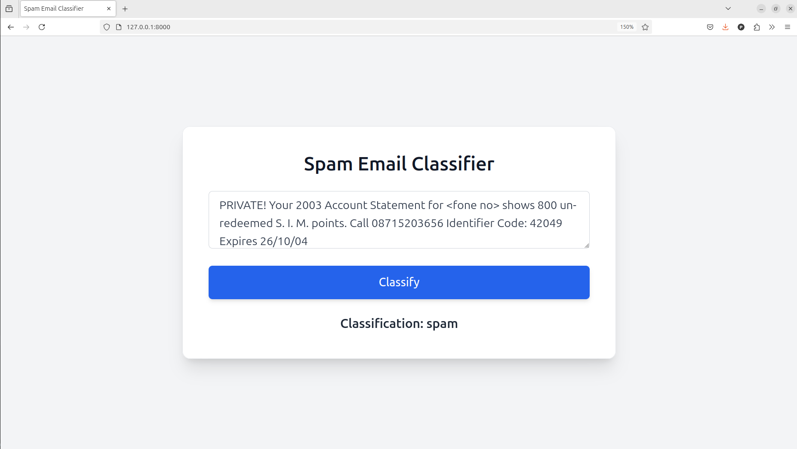

# 📧 Spam Email Classifier

A complete **Spam vs Ham** classifier project.  
- **Backend:** Django Rest Framework  
- **Frontend:** HTML, TailwindCSS, JavaScript  
- **Machine Learning Model:** Scikit-learn

---

## ✅ Features

- Spam detection using a trained ML model.
- REST API powered by Django Rest Framework.
- Clean, responsive frontend UI.
- CLI script for local predictions.
- Model training pipeline included.
- Easy project setup using `setup.py`.

---

## 🚀 Tech Stack

- **Frontend:** HTML5, TailwindCSS, JavaScript  
- **Backend:** Django 4+, Django REST Framework  
- **ML Model:** Python, Scikit-learn, Joblib  

---

## 📁 Folder Structure

```
SPAM-EMAIL-CLASSIFIER/
├── backend/
│   ├── api/
│   ├── classifier/
│   └── core/
├── frontend/
├── model_training/
├── environment.yml
├── requirements.txt
├── setup.py
└── README.md
```

---

## ⚙️ Installation & Setup

### 1. Clone the repository
```bash
git clone https://github.com/amartya-pandey/spamy.git
cd spamy
```

### 2. Install the project using setup.py  
This installs all Python dependencies and makes the CLI command available.

```bash
pip install .
```

> ✅ After installing, you can use the command-line shortcut:  
```bash
spam_classifier_manage runserver
```
This runs `backend/manage.py` directly using the entry point defined in `setup.py`.

---

## 🛠️ Backend Setup (Django + DRF)

Manually, you can still run:
```bash
cd backend
python manage.py migrate
python manage.py runserver
```

---

## 🌐 Frontend Setup

- Open `frontend/templates/index.html` in your browser.  
- Enter a message and click **Predict** to check if it's spam or ham.

---

## 🐍 Model Training (Optional)

If you want to retrain the model:
```bash
cd model_training
python train.py
```
- This generates `spam_classifier.joblib`  
- Replace it in: `backend/classifier/model/`

---

## 🎯 REST API Endpoints

### `POST /api/predict/`

**Request Body:**
```json
{
    "message": "Congratulations! You've won a free ticket."
}
```

**Response:**
```json
{
    "prediction": "spam"
}
```

---

## 🔨 CLI Prediction

Run the standalone predictor:
```bash
cd backend/classifier
python predict.py
```

---

## 🎨 Frontend UI

- HTML + TailwindCSS responsive layout  
- Vanilla JS handles the API requests  
- Located in `frontend/templates/index.html`

---

## 📦 setup.py Details

The `setup.py` script handles project packaging and installation:  
- Installs dependencies like Django, DRF, scikit-learn, etc.  
- Adds a `spam_classifier_manage` command as a shortcut to run Django's `manage.py` tasks.

### Manual Run:
```bash
python setup.py install
```

### CLI Shortcut Example:
```bash
spam_classifier_manage runserver
```

---

## 📸 Screenshots


---

## 📄 License

This project is open source under MIT License.